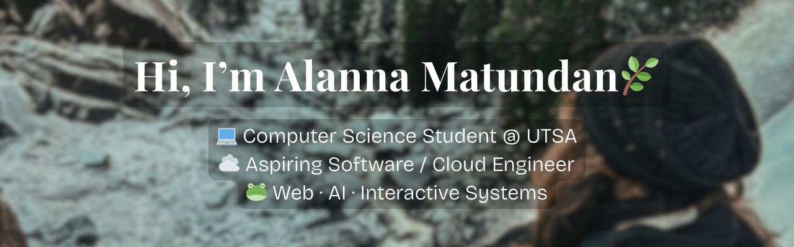

  

<!--
<h1 align="center">Hi, I'm Alanna Matundan 🌿</h1>

💻 Computer Science Student @ UTSA  
☁️ Aspiring Software / Cloud Engineer  
🐸 Web · AI · Interactive Systems

-->

  
  

  

## 🖥️ Tech Stack

### 🐸 Languages  

### 🌿 Frontend  

### 💻 Backend / Data  

### ⚙️ AI / ML  

### ☁️ Cloud / DevOps  

  

## 🌿 Featured Projects

### 📖 Hearts & Pages Bookstore

<table>
<tr>
<td width="60%">

Full-stack e-commerce platform

🌿 React + Supabase  
⚙️ Auth, cart, checkout system  
🐸 Admin dashboard  
🌱 Relational database design  

🎥 **Watch Demo:**  
https://www.youtube.com/watch?v=Re56C-EuaT4

</td>
<td width="40%" align="center">
  
</td>
</tr>
</table>

---

### 💻 Rivaldle – Web Guessing Game

<table>
<tr>
<td width="60%">

Cloud-deployed web game

☁️ AWS EC2 + Route 53  
🎮 Multiple game modes  
🌿 Daily challenges  
🐸 61k+ monthly users  

🎥 **Watch Demo:**  
https://www.youtube.com/watch?v=TgRu_6LoCtQ

</td>
<td width="40%" align="center">
  
</td>
</tr>
</table>

---

### 🎙️ AI Tech Interview Coach

<table>
<tr>
<td width="60%">

AI-powered interview preparation

🐸 OpenAI API integration  
🎤 Live voice interviews  
📷 Streaming evaluation  
🌱 Modular TypeScript UI  

🎥 **Watch Demo:**  
https://www.youtube.com/watch?v=JQwXc9wWWIs

</td>
<td width="40%" align="center">
  
</td>
</tr>
</table>

---

### 🎮 Cat Café Chaos (Unity)

<table>
<tr>
<td width="60%">

Stealth-chaos simulation

🐸 NPC AI state machines  
👣 NavMesh pathfinding  
⚙️ Chaos mechanics  
🎮 Event-driven gameplay  

🎥 **Watch Demo:**  
https://www.youtube.com/watch?v=jvDDeLSpqqk

</td>
<td width="40%" align="center">
  
</td>
</tr>
</table>

  

## 🐈‍⬛ GitHub Stats

  
  

  

---

## 🌿 Beyond Coding

🎥 YouTube Content Creator  
⚙️ 40+ tutorials · 3.1M+ views · 14k+ subscribers  

---

## 📱 Let's Connect

<table>
<tr>
<td width="65%" valign="middle">

📍 <b>New Braunfels, TX</b>  
📧 <a href="mailto:rosealanna18@gmail.com">rosealanna18@gmail.com</a>  
🌿 <a href="https://linkedin.com/in/alanna-matundan">LinkedIn</a>  
🐸 <a href="https://github.com/LovelyShades">GitHub</a>

</td>
<td width="35%" align="center" valign="middle">
  
</td>
</tr>
</table>

  

